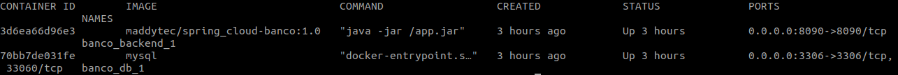
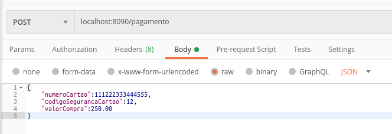
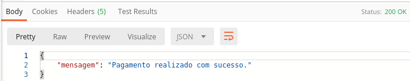
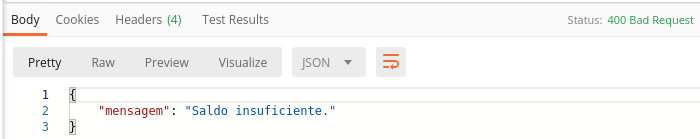

# Banco - Simulador financeiro da operadora de cartão de crédito

Microservices utilizando docker compose para envio da solicicitação de pagamento, com Spring Boot e banco de dados MySQL.

## Faça agora, porque na minha máquina funciona ;)
1. [Baixar projeto](#1-baixar-projeto)
2. [Inicializando os serviços](#2-inicializando-os-serviços)
3. [Como testar o projeto?](#3-como-testar-o-projeto)
  3.1 [Postman para realizar a requisição REST](#31-postman-para-realizar-a-requisição-REST)
 3.2 [Retorno da requisição de pagamento, caso possua limite de crédito disponível no cartão de crédito](#32-Retorno-da-requisição-de-pagamento-caso-possua-limite-de-crédito-disponível-no-cartão-de-crédito)
 3.3 [Retorno da requisição de pagamento, caso não tenha limite disponível no cartão de crédito](#33-Retorno-da-requisição-de-pagamento-caso-não-tenha-limite-disponível-no-cartão-de-crédito)
4. [Remover os serviços](#4-remover-os-servi%C3%A7os)
5. [Licença](#5-licença)

Requisitos necessários para prosseguir :
*  [Git](https://git-scm.com/downloads)
*  [Docker](https://docs.docker.com/get-docker/)
*  [Docker Compose](https://docs.docker.com/compose/install/)

## 1. Baixar projeto
- No console do seu sistema operacional execute o comando: 
 `$ git clone https://github.com/Maddytec/spring_cloud.git`

## 2. Inicializando os serviços
 - Comandos para iniciar os serviços:
 `$ cd banco`
 `$ docker-compose up -d`

- Comando para listar os serviços:
 `$ docker-compose ps`

 Figura 1 - Retorno do comando docker-compose ps

## 3. Como testar o projeto?

Após executar o item 2:
  
### 3.1 Postman para realizar a requisição REST

 - Utilize o método post, adicione a URL http://localhost:8090/pagamento e utilize o o payload abaixo:
 
 {
	"numeroCartao":111222333444555,
	"codigoSegurancaCartao":12,
	"valorCompra":250.00
 }

 Figura 2 - Requisição de pagamento
  
### 3.2 Retorno da requisição de pagamento, caso possua limite de crédito disponível no cartão de crédito

 Figura 3 - Payload de retorno positivo da requisição 

### 3.3 Retorno da requisição de pagamento, caso não tenha limite disponível no cartão de crédito

 Figura 4 - Payload de retorno positivo da requisição

## 4. Remover os serviços
- Comando para parar os serviços:
 `$ docker-compose stop`

- Comando para remover os serviços:
 `$ docker-compose rm`

## 5. Licença

Este código é open source (código aberto).
