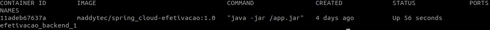
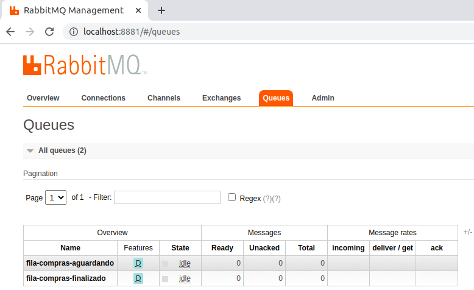
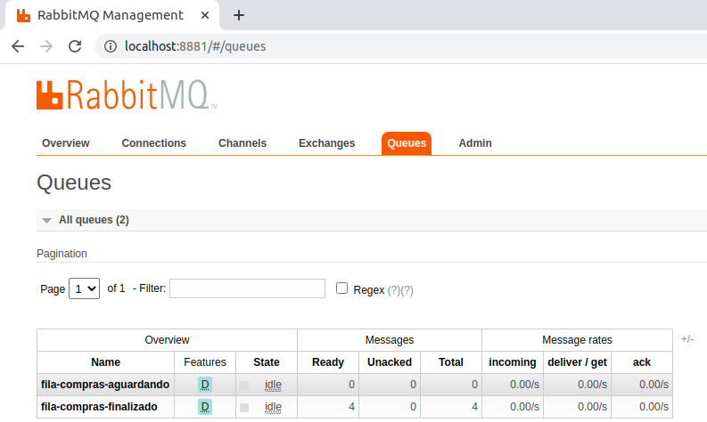
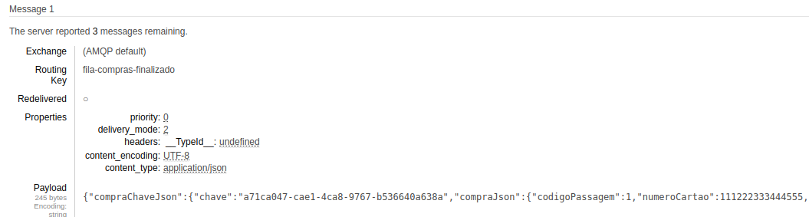
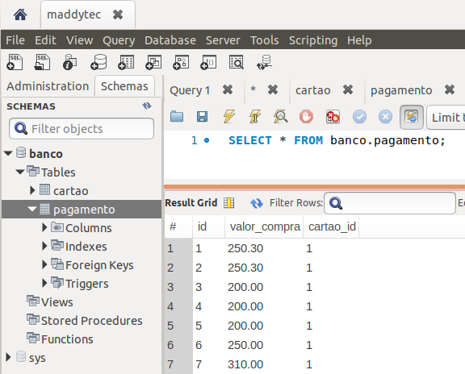

# Efetivação - Leitura da fila de solicitações de compra, envio da solicitação para a operadora de cartão de crédito, finaliza a compra enviando o resultado da solicitação de compra de passagem para fila de resultado da compra

Microservices utilizando docker compose, Spring Boot para consumir e fornecer requisições em filas RabbitMQ. Além disso, consumir o serviço externo de banco(Operadora de Cartão de Crédito), com o objetivo geral de tolerancia a falhas  

## Faça agora, porque na minha máquina funciona ;)
1. [Baixar projeto](#1-baixar-projeto)
2. [Inicializando os serviços](#2-inicializando-os-serviços)
3. [Como testar o projeto?](#3-como-testar-o-projeto)
  3.1 [Fila de requisição de compra e fila de retorno da requisição de compra enviada para o banco](#31-Fila-de-requisição-de-compra-e-fila-de-retorno-da requisição-de-compra-enviada-para-o-banco)
 3.2 [Consumo da fila fila-compras-aguardando, envio da requisição para o banco e gravação do retorno do banco na fila fila-compras-finalizado](#32-Consumo-da-fila-fila-compras-aguardando-envio-da-requisição-para-o-banco-e-gravação-do-retorno-do-banco-na-fila-fila-compras-finalizado)
4. [Remover os serviços](#4-remover-os-servi%C3%A7os)
5. [Licença](#5-licença)

Requisitos necessários para prosseguir :
*  [Git](https://git-scm.com/downloads)
*  [Docker](https://docs.docker.com/get-docker/)
*  [Docker Compose](https://docs.docker.com/compose/install/)

## 1. Baixar projeto
- No console do seu sistema operacional execute o comando: 
 `$ git clone https://github.com/Maddytec/spring_cloud.git`

## 2. Inicializando os serviços
 - Comandos para iniciar os serviços:
 `$ cd efetivacao`
 `$ docker-compose up -d`

- Caso os serviços de passagem não estejam em execução, execute os seguintes comandos:
  `$ cd ..`
  `$ cd passagem
  `$ docker-compose up -d
 
 - Caso os serviços de banco não estejam em execução, execute os seguintes comandos:
  `$ cd ..`
  `$ cd banco
  `$ docker-compose up -d

- Comando para listar os serviços:
 `$ docker-compose ps`

 Figura 1 - Retorno do comando docker-compose ps

## 3. Como testar o projeto?

Após executar o item 2:
  
### 3.1 Fila de requisição de compra e fila de retorno da requisição de compra enviada para o banco

- As requisições de compras são enviadas para fila "fila-compras-aguardando" do RabbitMQ que é disponibilizado pela API passagem. De imediato, a fila "fila-compras-finalizado" é criada pela API efetivação, para armazenar o retorno das requisições de compras enviadas para a API banco, para acessar a interface das filas  adicione a URL http://localhost:8881/ no seu navegador e em seguida preencha o Usuario e senha:
Usuario: maddytec
Senha: maddytec

 Figura 2 - Filas
  
### 3.2 Consumo da fila fila-compras-aguardando, envio da requisição para o banco e gravação do retorno do banco na fila fila-compras-finalizado
 
 - Se já foi enviado solicitações de compra para a API de passagem e a fila fila-compras-aguardando estão com as colunas Ready e Total com valor zero, podemos concluir que foi consumida pela API efetivação  
 - A fila-compras-finalizado com as colunas Ready e Total com os valorer maior que zero, evidencia o envio das requisições de compras para a API banco e gravação do retorno da requisição de compra. Caso o serviço da API do banco estivesse indisponivel, a API de efetivação gravaria novamente na fila fila-compras-aguardando até que a API banco retorne as atividades. 

 Figura 3 - Consumo e grvação de retorno das requisições de compras

- Payload de retorno gravado na fila fila-compras-finalizado com retorno da API banco
{"compraChaveJson":{"chave":"a71ca047-cae1-4ca8-9767-b536640a638a","compraJson":{"codigoPassagem":1,"numeroCartao":111222333444555,"codigoSegurancaCartao":12,"valorPassagem":200}},"mensagem":"Pagamento realizado com sucesso.","pagamentoOK":true}

 Figura 4 - Requisição gravada na fila fila-compras-finalizado com o retorno do banco  

 - Gravações de requisições de compras efetuadas com sucesso no banco de dados  

 Figura 5 - Requisições enviada para API banco e gravada na tabela de pagamento  

## 4. Remover os serviços
- Comando para parar os serviços:
 `$ docker-compose stop`

- Comando para remover os serviços:
 `$ docker-compose rm`

## 5. Licença

Este código é open source (código aberto).
