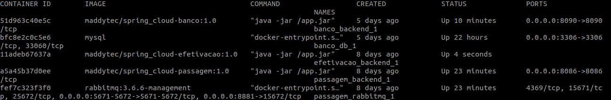

# Efetivação - Leitura da fila de solicitações de compra, envio da solicitação para a operadora de cartão de crédito, finaliza a compra enviando o resultado da solicitação de compra de passagem para fila de resultado da compra

Microservices utilizando docker compose, Spring Boot para consumir e fornecer requisições em filas RabbitMQ. Além disso, consumir o serviço externo de banco(Operadora de Cartão de Crédito), com o objetivo geral de tolerancia a falhas  

## Faça agora, porque na minha máquina funciona ;)
1. [Baixar projeto](#1-baixar-projeto)
2. [Inicializando os serviços](#2-inicializando-os-serviços)

.....

4. [Remover os serviços](#4-remover-os-servi%C3%A7os)
5. [Licença](#5-licença)

Requisitos necessários para prosseguir :
*  [Git](https://git-scm.com/downloads)
*  [Docker](https://docs.docker.com/get-docker/)
*  [Docker Compose](https://docs.docker.com/compose/install/)

## 1. Baixar projeto
- No console do seu sistema operacional execute o comando: 
 `$ git clone https://github.com/Maddytec/spring_cloud.git`

## 2. Inicializando os serviços
 - Comandos para iniciar os serviços:
 `$ cd efetivacao`
 `$ docker-compose up -d`

- Comando para listar os serviços:
 `$ docker-compose ps`

 Figura 1 - Retorno do comando docker-compose ps

......

## 4. Remover os serviços
- Comando para parar os serviços:
 `$ docker-compose stop`

- Comando para remover os serviços:
 `$ docker-compose rm`

## 5. Licença

Este código é open source (código aberto).
