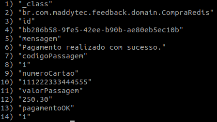

# Feedback - Consome da fila de compras finalizadas os resultados das compras de passagens, em seguida envia para o banco de dados o resultado das solicitações. Além de expor a consulta dos resultados das solicitações de compras de passagem efetuadas

Microservices utilizando docker compose, Spring Boot para consumir requisições em filas RabbitMQ, salvando as mesmas no banco de dados não relacional REDIS e expondo a consulta REST dos resultados das compras finalizadas.  

## Faça agora, porque na minha máquina funciona ;)
1. [Baixar projeto](#1-baixar-projeto)
2. [Inicializando os serviços](#2-inicializando-os-serviços)
3. [Como testar o projeto?](#3-como-testar-o-projeto)
  3.1 [Consumo da fila de retorno das requisições de compras](#31-Consumo-da-fila-de-retorno-das-requisições-de-compras)
 3.2 [Envio dos resultados das solicitações de compras para o banco REDIS](#32-Envio-dos-resultados-das-solicitações-de-compras-para-o-banco-REDIS)
 3.3 [Postman para realizar a consulta REST dos resultados das solicitações de compras](#33-Postman-para-realizar-a-consulta-REST-dos-resultados-das-solicitações-de-compras)
4. [Remover os serviços](#4-remover-os-servi%C3%A7os)
5. [Licença](#5-licença)

Requisitos necessários para prosseguir :
*  [Git](https://git-scm.com/downloads)
*  [Docker](https://docs.docker.com/get-docker/)
*  [Docker Compose](https://docs.docker.com/compose/install/)

## 1. Baixar projeto
- No console do seu sistema operacional execute o comando: 
 `$ git clone https://github.com/Maddytec/spring_cloud.git`

## 2. Inicializando os serviços

- Caso os serviços de banco não estejam em execução, execute os seguintes comandos:
  `$ cd banco`
  `$ docker-compose up -d`

- Caso os serviços de passagem não estejam em execução, execute os seguintes comandos:
  `$ cd ..`
  `$ cd passagem`
  `$ docker-compose up -d`

- Caso os serviços de efetivação não estejam em execução, execute os seguintes comandos:
  `$ cd ..`
  `$ cd efetivacao`
  `$ docker-compose up -d`

- Finalmente, comandos para iniciar os serviços:
 `$ cd ..`
 `$ cd feedback`
 `$ docker-compose up -d`

- Comando para listar os serviços:
 `$ docker-compose ps`

 Figura 1 - Retorno do comando docker-compose ps

## 3. Como testar o projeto?

Após executar o item 2:
  
### 3.1 Consumo da fila de retorno das requisições de compras

- Se houver registros na fila "fila-compras-finalizado" os mesmos serão consumidos pela API feedback. Logo, as colunas Ready e Total apresentarão valor zero. Para acessar a interface das filas, adicione a URL http://localhost:8881/ no seu navegador e em seguida preencha o Usuario e senha:
 Usuario: maddytec
 Senha: maddytec
 
 Figura 2 - Filas
  
### 3.2 Envio dos resultados das solicitações de compras para o banco Redis
 
 - Após o cunsumo da fila "fila-compras-finalizado", a API feedback grava no banco de dados Redis a mensagem da fila.
 - Para acessar o banco de dados Redis, execute os seguintes comandos:
   `$ docker exec -it feedback_redis_1 sh`
   `$ redis-cli`
 
 - Execute o commando a baixo para listar as chaves
  `$ keys *`
  
  Figura 3 - Chaves gravadas

 - Substitua a chave no comando abaixo, por uma corresponente ao listado no comando executado anteriormente:
  `$ hgetall compra:bb286b58-9fe5-42ee-b90b-ae80eb5ec10b`
  
  Figura 4 - Chave valor

### 3.3 Postman para realizar a consulta REST dos resultados das solicitações de compras

 - Utilize o método get, adicione a URI http://localhost:8082/bb286b58-9fe5-42ee-b90b-ae80eb5ec10b com o chave de sua requisição como parametro de sua URI:

 Figura 5 - Consulta do resultado da compra que foi gravada no banco Redis

 
## 4. Remover os serviços
- Comando para parar os serviços:
 `$ docker-compose stop`

- Comando para remover os serviços:
 `$ docker-compose rm`

## 5. Licença

Este código é open source (código aberto).
