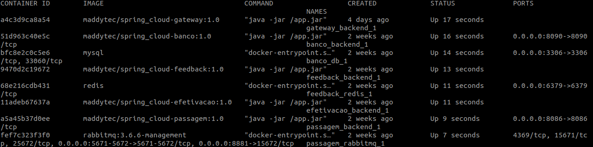
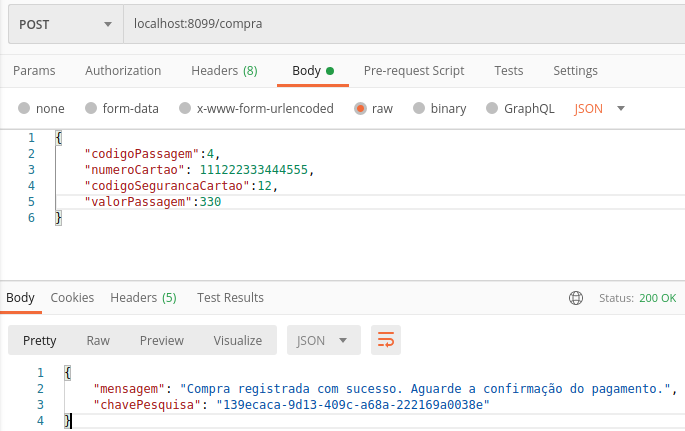
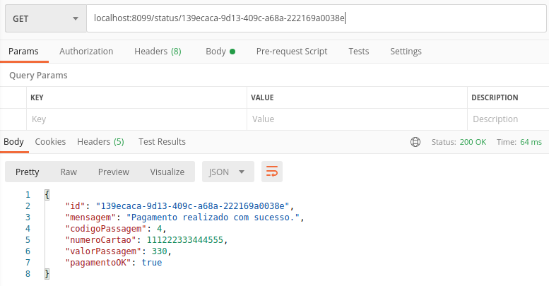

# Gateway - Disponibiliza os endpoints para os serviços de compra de passagem e consulta do status da compra.

Microservices utilizando docker compose, Spring Boot para centralizar as requisições e proteger a rede de containers.  

## Faça agora, porque na minha máquina funciona ;)
1. [Baixar projeto](#1-baixar-projeto)
2. [Inicializando os serviços](#2-inicializando-os-serviços)
3. [Como testar o projeto?](#3-como-testar-o-projeto)
  3.1 [Postman para realizar a requisição REST](#31-Postman-para-realizar-a-requisição-REST)
  3.2 [Postman para realizar a consulta REST dos resultados das solicitações de compras](#32-Postman-para-realizar-a-consulta-REST-dos-resultados-das-solicitações-de-compras)
4. [Remover os serviços](#4-remover-os-servi%C3%A7os)
5. [Licença](#5-licença)

Requisitos necessários para prosseguir :
*  [Git](https://git-scm.com/downloads)
*  [Docker](https://docs.docker.com/get-docker/)
*  [Docker Compose](https://docs.docker.com/compose/install/)

## 1. Baixar projeto
- No console do seu sistema operacional execute o comando: 
 `$ git clone https://github.com/Maddytec/spring_cloud.git`

## 2. Inicializando os serviços

- Caso os serviços de banco não estejam em execução, execute os seguintes comandos:
  `$ cd banco`
  `$ docker-compose up -d`

- Caso os serviços de passagem não estejam em execução, execute os seguintes comandos:
  `$ cd ..`
  `$ cd passagem`
  `$ docker-compose up -d`

- Caso os serviços de efetivação não estejam em execução, execute os seguintes comandos:
  `$ cd ..`
  `$ cd efetivacao`
  `$ docker-compose up -d`

- Caso os serviços de feedback não estejam em execução, execute os seguintes comandos:
  `$ cd ..`
  `$ cd feedback`
  `$ docker-compose up -d`

- Finalmente, comandos para iniciar os serviços:
 `$ cd ..`
 `$ cd gateway`
 `$ docker-compose up -d`

- Comando para listar os serviços:
 `$ docker-compose ps`

 Figura 1 - Retorno do comando docker-compose ps

## 3. Como testar o projeto?

Após executar o item 2:
  
### 3.1 Postman para realizar a requisição REST

 - Utilize o método post, adicione a URI http://localhost:8099/compra e utilize o payload abaixo, ao enviar a requisição haverá o redirecionamento para API de compra de passagem que está na porta 8086:
 
 {
	 &emsp;"codigoPassagem":4,
	 &emsp;"numeroCartao": 111222333444555,
	 &emsp;"codigoSegurancaCartao":12,
	 &emsp;"valorPassagem":330
 }

 Figura 2 - Requisição e retorno
  
### 3.2 Postman para realizar a consulta REST dos resultados das solicitações de compras

 - Utilize o método get, adicione a URI http://localhost:8099/status/139ecaca-9d13-409c-a68a-222169a0038e com a chave de sua requisição como parametro da mesma:

 Figura 3 - Consulta do resultado da compra que foi gravada no banco Redis

## 4. Remover os serviços
- Comando para parar os serviços:
 `$ docker-compose stop`

- Comando para remover os serviços:
 `$ docker-compose rm`

## 5. Licença

Este código é open source (código aberto).
