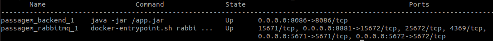
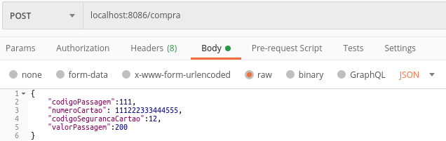
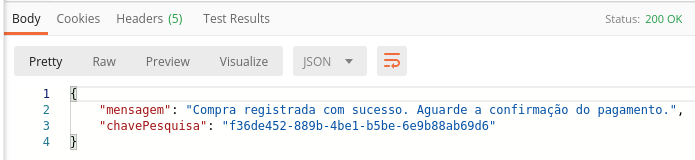
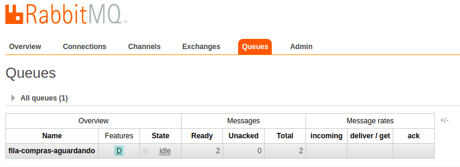
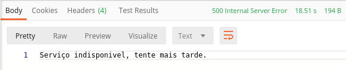

# Passagem - Envio da solicitação de compra de passagem

Microservices utilizando docker compose para envio da solicicitação de compra, com Spring Boot e fila RabbitMQ para tolerancia a falhas

## Faça agora, porque na minha máquina funciona ;)
1. [Baixar projeto](#1-baixar-projeto)
2. [Inicializando os serviços](#2-inicializando-os-serviços)
3. [Como testar o projeto?](#3-como-testar-o-projeto)
  3.1 [Postman para realizar a requisição REST](#31-postman-para-realizar-a-requisição-REST)
 3.2 [Retorno da requisição de compra, com serviço de fila RabbitMQ disponível](#32-Retorno-da-requisição-de-compra-com-serviço-de-fila-RabbitMQ-disponível)
 3.3 [Requisição de compra na Fila RabbitMQ](#33-Requisição-de-compra-na-Fila-RabbitMQ)
 3.4 [Retorno da requisição de compra, caso o serviço de fila RabbitMQ não esteja disponível](#34-Retorno-da-requisição-de-compra-caso-o-serviço-de-fila-RabbitMQ-não-esteja-disponível)
4. [Remover os serviços](#4-remover-os-servi%C3%A7os)
5. [Licença](#5-licença)

Requisitos necessários para prosseguir :
*  [Git](https://git-scm.com/downloads)
*  [Docker](https://docs.docker.com/get-docker/)
*  [Docker Compose](https://docs.docker.com/compose/install/)

## 1. Baixar projeto
- No console do seu sistema operacional execute o comando: 
 `$ git clone https://github.com/Maddytec/spring_cloud.git`

## 2. Inicializando os serviços
 - Comandos para iniciar os serviços:
 `$ cd passagem`
 `$ docker-compose up -d`

- Comando para listar os serviços:
 `$ docker-compose ps`

 Figura 1 - Retorno do comando docker-compose ps

## 3. Como testar o projeto?

Após executar o item 2:
  
### 3.1 Postman para realizar a requisição REST

 - Utilize o método post, adicione a URL http://localhost:8086/compra e utilize o payload abaixo:
 
 {
	"codigoPassagem":111,
	"numeroCartao": 111222333444555,
	"codigoSegurancaCartao":12,
	"valorPassagem":200
}

 Figura 2 - Requisição
  
### 3.2 Retorno da requisição de compra, com serviço de fila RabbitMQ disponível

 Figura 3 - Payload de retorno positivo da requisição 

### 3.3 Requisição de compra na Fila RabbitMQ
 - As solicitações enviadas no item 3.1 são enviadas para fila do RabbitMQ, para acessar a interface adicione a URL http://localhost:8881/ no seu navegador e em seguida preencha o Usuario e senha:
 	 Usuario: maddytec
	 Senha: maddytec

 Figura 4 - Requisições enviada para Queue "fila-compras-aguardando"  

### 3.4 Retorno da requisição de compra, caso o serviço de fila RabbitMQ não esteja disponível
 `$ docker stop passagem_rabbitmq_1`

 Figura 5 - Payload de retorno negativo da requisição

## 4. Remover os serviços
- Comando para parar os serviços:
 `$ docker-compose stop`

- Comando para remover os serviços:
 `$ docker-compose rm`

## 5. Licença

Este código é open source (código aberto).
